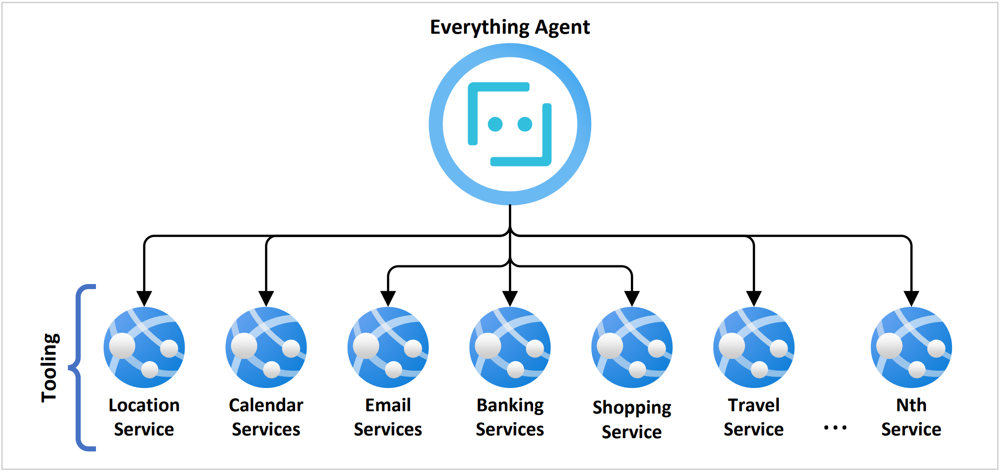
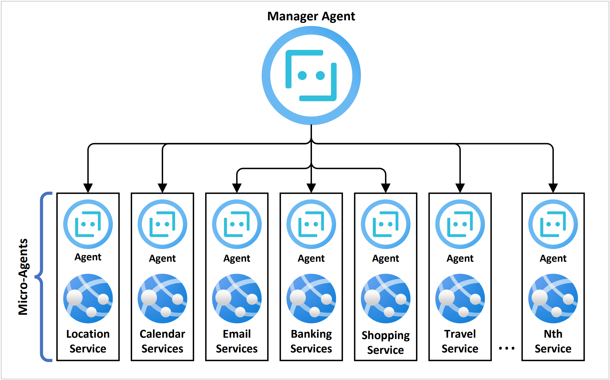

# MicroAgents Demo
This repo contains a demo app associated with the blog: [MicroAgents: Exploring Agentic Architecture with Microservices](https://devblogs.microsoft.com/semantic-kernel/microagents-exploring-agentic-architecture-with-microservices/) by Alex Chao & Chris Rickman.

## Goal

The *MicroAgent* concept is derived from *MicroServices* in the sense of coordinating loosely coupled microagents, each of which is paired to a specific api / domain.

To explore the *MigroAgent* pattern this project defines several several _demo_ cases based on a mock tool set.

For the purposes of this demo, no training shots where utilized.
In addition, no storage, memory capture, learning re-inforcement, or guard rails have been introduced.
The goal here is to isolate differences in model behavior based soley on the *MicroAgent* pattern.

As part of this, no user-interaction other than the initial objective is supported and this objective includes intential ambiguity.

## MonoAgent
Consider a monolithic agent that manages a large tool set:


## MicroAgent

The MicroAgent pattern delegates api interaction to specialized agents.
This allows each *MicroAgent* to be tailored for a specific context and allows for re-use.

> Note: GPT4 currently limits the total number of tools in a completion request to 128.  The *MicroAgent* patterns raises this limit to 16384 (128²).



## Setup
Configuration for the demo based on the following environment variables:

1. `OPENAI_KEY` - The OpenAI API key
1. `OPENAI_MODEL` - The target transformer model (defaults to `gpt-4-1106-preview`)
1. `RESULT_PATH` - The output path for writing results (defaults to `./results`)
 
Only `OPENAI_KEY` is required.  Example (PowerShell):

```powershell
 $Env:OPENAI_KEY='sk-000000000000000000000000000000000000000000000000'
```

## Execution
The demo takes a single parameter, which is the name of the demo to run:

- Calendar
- Banking
- Travel

Each demo run on both a *mono* and *micro* agent architecture, for comparison.

Example:

```cmd
cd src
dotnet run Travel
```

## Results

### Calendar Benchmark

To validate the the overall process, the `Calendar` demo was ran repeatedly for both agent types.

> The `Calendar` demo is a simple bench mark that utilizes two tools from the `Calendar API`:
> 1. Call tool to get current date.
> 1. Compute the dates for "next month"
> 1. Call tool to retrieve the list of next month's the calendar events
> 1. Identify openings on calendar for 5 day vacation

This provided the following results:

|Agent|Completion|Attempts|Success%|Min. Duration|Avg. Duration|Max. Duration|
|---|---|---|---|---|---|---|
|Mono|34|45|76%|15.52s|22.81s|36.42s|
|Micro|40|45|89%|17.93s|35.12s|70.14s|

The microagent approach shows a higher success rate but also larger latencies.

Types of failures observed:

- Identifying a span with less than 5 days
- Mis-identified "next month" (as the current month)
- Selected a return date that is same day as leaving for work trip
- Selected a span that would require cancelling dentist

### Travel Comparison

The `Travel` demo provides a more complex task to coordinate:

> 1. Call tool to get current date.
> 1. Compute the dates for "next month"
> 1. Call tool to retrieve the list of next month's the calendar events
> 1. Identify openings on calendar for 5 day vacation
> 1. Call tool to retrieve flight listings for candidate dates
> 1. Identify departing and return flights
> 1. Book departing and return flights

This provided the following results:

|Agent|Completion|Attempts|Success%|Min. Duration|Avg. Duration|Max. Duration|
|---|---|---|---|---|---|---|
|Mono|17|50|34%|50.11s|88.90s|156.95s|
|Micro|30|50|60%|89.61s|146.53s|288.97s|

> Note: The durations calculations are limited to successful task completions.

Types of failures observed:

- Wouldn't book without user confirmation (dominant _Micro_ failure)
- No return flight (dominant _Mono_ failure)
- Extra flight booked (mixed)
- Wrong date (_Mono_: once)
- Wrong departure location (_Mono_: once)

When treating cases as successful where booking information had been correctly determined but required user confirmation to proceed with booking, **the _MicroAgent_ success rate becomes 92% (46/50)!!!**

Either approach would vary with regards to adding the trip to the calendar or checking the weather forcast.  While doing so affected total duration, the precence or absence of these activities did not impact the success criteria.

Sometimes when calendar entry was created, icons were included in the title: `Enjoy your trip to Hawaii! 🌴✈️`

## Analysis

While a monolithic agent pattern benefits from overall lower latency, it appears to struggle with insuffient semantic narrowing while coordinating too many details for higher complexity tasks.

The *MicroAgent* pattern exhibits higher latency primarily due to the increased number of network requests related to creating and managing delegated conversations (with *MicroAgents).

As task complexity increases, the *MicroAgent* pattern shows significantly higher success rate and a higher propensity to seek confirmation / respect guard-rails.

For example, the *MicroAgent* is able to instruct the requesting agent on how to correct an incomplete objective:

> **Manager Agent:** I'm looking to book a vacation to Hawaii, preferably to Kona, for five days during one of these two ranges: March 2nd to March 6th or March 21st to March 25th. Can you find available flights for these dates?
>
> **Travel Agent:** Certainly! To assist you further, I would need to know your departure city to search for flights to Kona, Hawaii. Could you please provide me with the city or airport from which you will be leaving?
